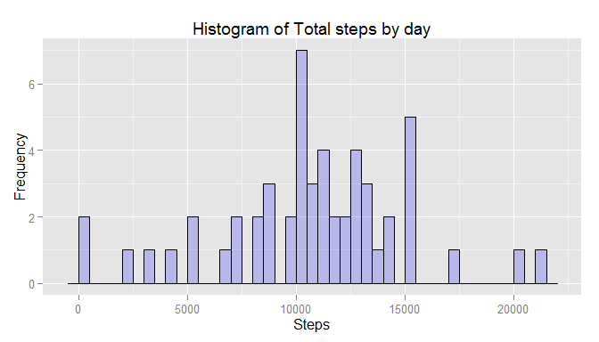

## COURSERA: Reproducible Research
### Peer Assesment #1 : Activity Monitoring Data
#### by Deborah Waissman Nov/2015  

##### This project will make use of data from a personal activity monitoring device. This device collects data at 5 minute intervals through out the day. The data consists of two months of data from an anonymous individual collected during the months of October and November, 2012 and include the number of steps taken in 5 minute intervals each day.    

    
#####1 Set up general options and load necessary libraries.  

```r
library("knitr")
opts_chunk$set(echo=TRUE, fig.height=4)
library(ggplot2)
```

#####2 Unzip and read dataset with activity montitoring. Original data source:[activity file](https://d396qusza40orc.cloudfront.net/repdata%2Fdata%2Factivity.zip)

```r
activityfile<-unzip("activity.zip")
activity<- read.csv(activityfile, colClasses =c("numeric","character","numeric"))
```

----------------------------------------------------------------------------------------------------------------------------------------------------------------------------------------------------------  

####What is mean total number of steps taken per day?
#####3 Calculate and plot total, report on mean and median number of steps taken by day.

```r
df <- aggregate(activity$steps, by=list(activity$date), FUN=sum) 
ggplot( data=df, aes(x)) +   
        geom_histogram(col="black", fill="blue", alpha = .2, binwidth= 500) +
        labs(title="Histogram of Total steps by day") +
        labs(x="Steps", y="Frequency")
```

 

**The mean of total steps taken by day is: 10,766**  
**The median of total steps taken by day is: 10,765**  

----------------------------------------------------------------------------------------------------------------------------------------------------------------------------------------------------------  

####What is the average daily activity pattern?
#####4 Calculate and plot average steps by interval across all days, report on max interval.

```r
df <- aggregate(activity$steps, by=list(activity$interval), FUN=mean, na.rm=T) 
ggplot( data=df, aes(x= Group.1, y=x)) +   
        geom_line(colour="blue", alpha = .5) +
        labs(title="Average steps by interval") +
        labs(x="Intervals", y="Steps")
```

 

**The 5 min interval with maximum number of steps is: 835**  

----------------------------------------------------------------------------------------------------------------------------------------------------------------------------------------------------------  

####Imputing missing values
#####5 Calculate total number of NA. Substitute NA with avg of interval taken from previous data frame.

```r
nacount<- sum(is.na(activity$steps))
xx <- (merge(df, activity, by.x = "Group.1", by.y="interval"))
xx$steps[is.na(xx$steps)] <- (xx$x[is.na(xx$steps)])

dfi <- aggregate(xx$steps, by=list(xx$date), FUN=sum) 
ggplot( data=dfi, aes(x)) +   
        geom_histogram(col="black", fill="blue", alpha = .2, binwidth= 500) +
        labs(title="Histogram of Total steps by day - imputing missing values") +
        labs(x="Steps", y="Frequency")
```

 

**The total number of NA values before imputing was: 2,304**  
**The mean of total steps taken by day is: 10,766**  
**The median of total steps taken by day is: 10,766**  

**Histogram imputing missing values looks similar to the histogram with NA values, however frequency scale is different.**  
**Imputing missing values made no impact on mean/median due to equal number of occurrences.**  

----------------------------------------------------------------------------------------------------------------------------------------------------------------------------------------------------------    

####Are there differences in activity patterns between weekdays and weekends?
#####6 Assign type of day, calculate avg steps by interval by type

```r
xx$id <- weekdays(as.Date(xx$date,"%Y-%m-%d"), abbreviate=T)
xx$type <- factor(xx$id)
levels(xx$type) <- list(
        Weekday = c("Mon", "Tue", "Wed", "Thu", "Fri"),
        Weekend = c("Sat", "Sun") )

df <- aggregate(xx$steps, by=list(xx$Group.1,xx$type), FUN=mean) 
ggplot( df, aes(x= Group.1, y=x))+
        geom_line(colour="blue", alpha = .5)+facet_grid(Group.2 ~ . ) +
        labs(title="Average steps by interval by type of day") +
        labs(x="Intervals", y="Steps") +        
        theme(plot.background = element_rect(fill = "white", colour="black"))
```

 

**Activity during weekends is more uniform throught the day. On weekdays we can observe a peak on interval 900. Therefore we can deduct that the period of most activity for the subject is about mid-morning during weekdays.**  
